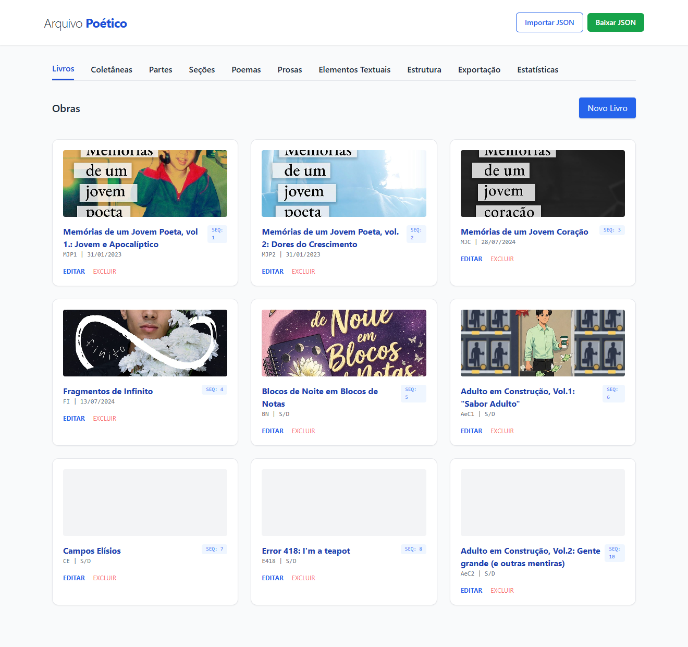
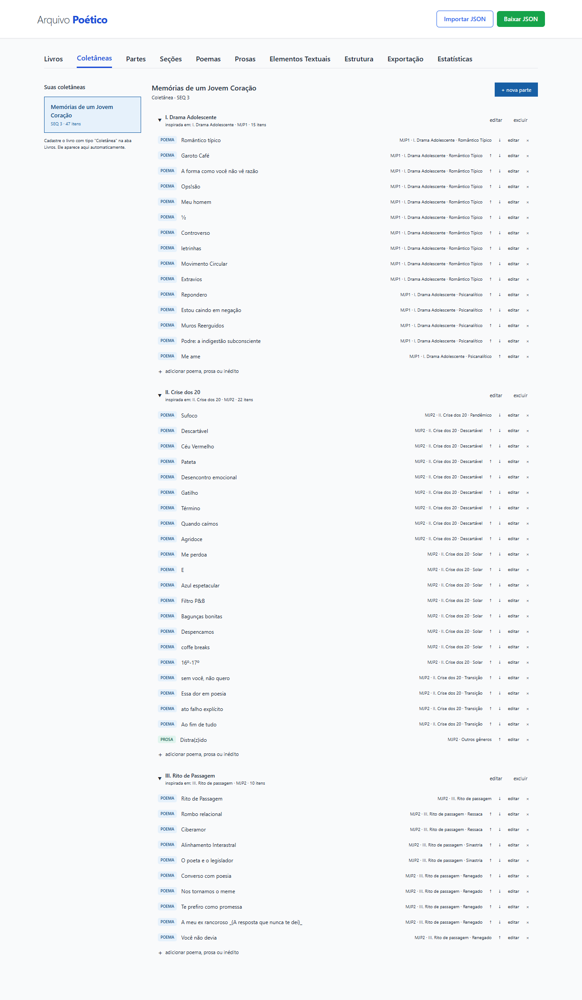
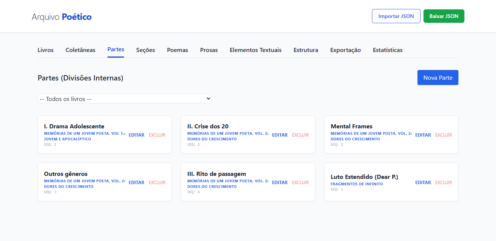
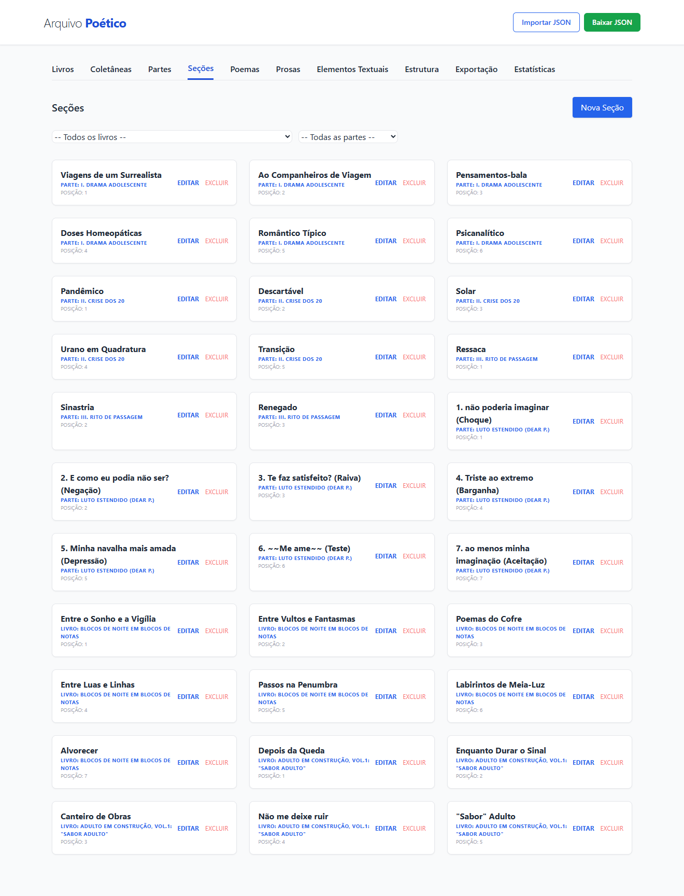
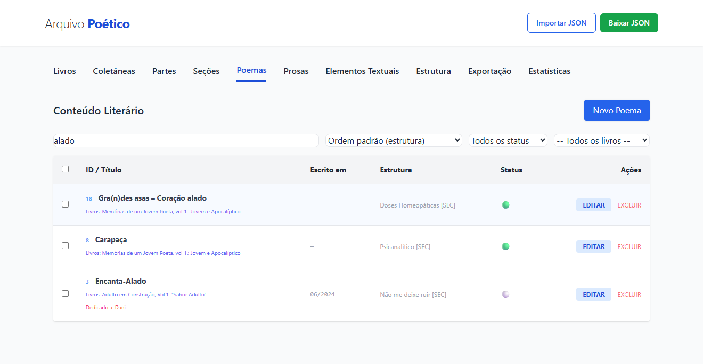
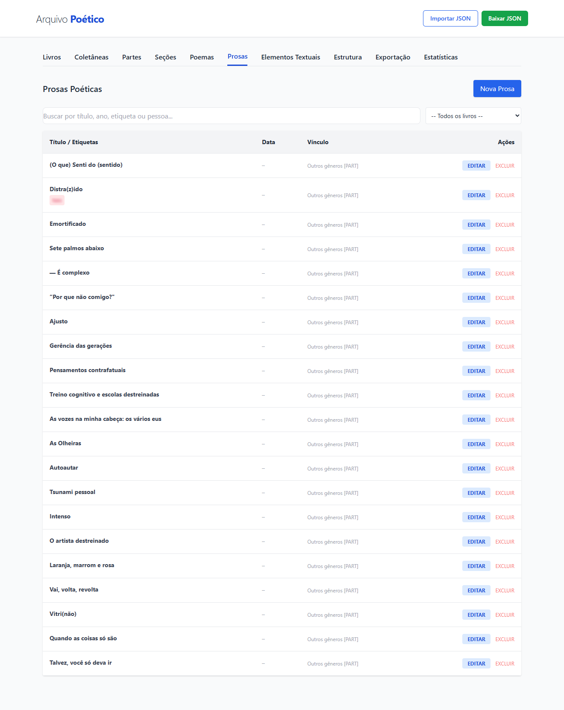
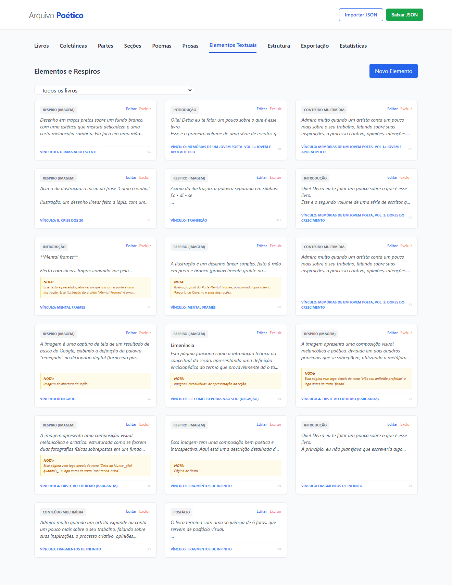
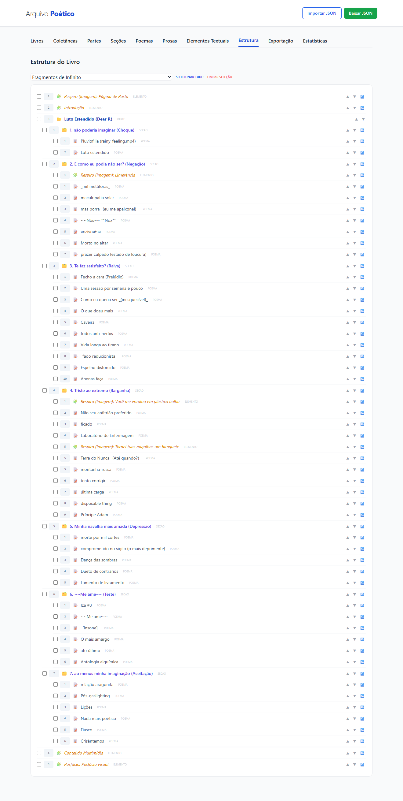
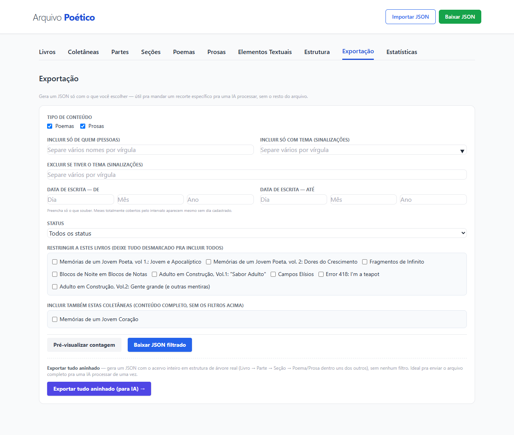
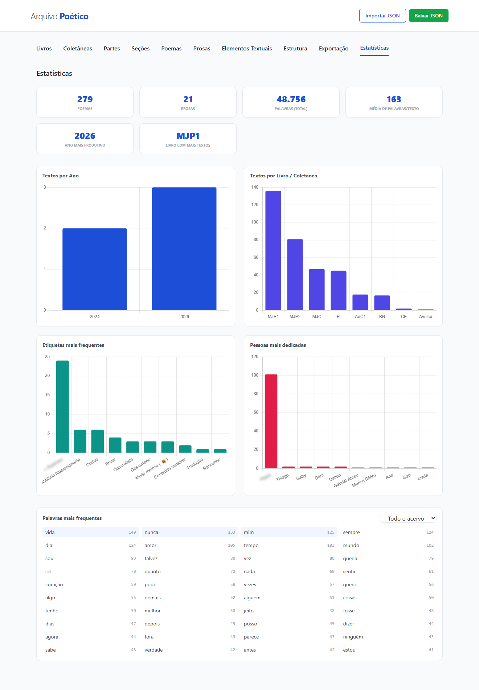

# Arquivo Poético

Aplicativo local (sem backend) para organizar, editar e exportar um acervo de
poemas, prosas, livros e coletâneas. Tudo roda no navegador; os dados textuais
ficam salvos em `localStorage` e as capas (imagens) em `IndexedDB`. Os arquivos
`.json` são usados para backup e troca de dados — eles não incluem imagens.

---

## Como rodar

O app usa ES Modules, então **não funciona abrindo o `index.html` diretamente**
pelo sistema de arquivos (restrição de CORS do navegador). É preciso um servidor
local estático:

- **VS Code:** instale a extensão [Five Server](https://marketplace.visualstudio.com/items?itemName=yandeu.five-server) ou Live Server e clique em "Go Live"
- **Python:** `python -m http.server` na pasta do projeto, depois acesse `http://localhost:8000`
- **Node:** `npx serve .` na pasta do projeto

Nenhuma dependência precisa ser instalada. Chart.js e Tailwind CSS são carregados via CDN.

---

## Capturas de tela

### Livros


### Coletâneas


### Partes


### Seções


### Poemas


### Prosas


### Elementos


### Estrutura


### Exportar


### Estatísticas


---

## Estrutura de pastas

```
/
├── index.html               → Esqueleto do app: header, nav, abas e #modais-container
├── README.md
│
├── assets/
│   ├── css/
│   │   └── style.css        → Estilos complementares ao Tailwind (CDN)
│   ├── icons/
│   │   └── favicon.svg, favicon-32.png, favicon-180.png
│   ├── logo/
│   │   └── Logo.png, Logo.ai, Logo (variações).png, Logo (com margem).png
│   └── screenshots/         → Capturas de tela para o README
│
├── js/                       → Toda a lógica do app (ES Modules)
│   ├── main.js               → Ponto de entrada; liga os onclick="" do HTML às
│   │                           funções e registra cada modal (id, arquivo, init)
│   ├── db.js                 → Estado central + persistência (localStorage)
│   ├── capas.js              → Armazenamento de imagens de capa via IndexedDB;
│   │                           redimensiona e comprime automaticamente no upload
│   ├── modais.js             → Carregamento lazy dos modais via fetch, com cache
│   ├── ui.js                 → Abas, dropdowns, auto-preenchimento (reexporta
│   │                           toggleModal/garantirModal de modais.js)
│   ├── render.js             → Renderização das listas/tabelas; carrega capas
│   │                           de forma assíncrona e exibe lightbox navegável ao clicar
│   ├── forms.js              → Submit/edição de Livro, Parte, Seção, Poema,
│   │                           Prosa, Elemento
│   ├── editor.js             → Toolbar de formatação do texto + tags/pessoas
│   ├── coletaneas.js         → Lógica da aba de Coletâneas
│   ├── estatisticas.js       → Painel de estatísticas (Chart.js)
│   ├── exportar.js           → Exportação filtrada + exportação aninhada completa
│   ├── nesting.js            → Lógica de encadeamento hierárquico (usada por
│   │                           exportar.js)
│   └── utils.js              → Funções puras sem dependências internas;
│                               inclui modal de confirmação de exclusão
│
├── modais/                    → HTML de cada modal, carregado sob demanda
│   ├── modal-livro.html
│   ├── modal-parte.html
│   ├── modal-secao.html
│   ├── modal-poema.html
│   ├── modal-prosa.html
│   ├── modal-elemento.html
│   ├── modal-col-parte.html
│   └── modal-col-item.html
│
└── data/
    └── arquivo_poetico_backup.json   → Exemplo/backup de dados (não é lido automaticamente)
```

---

## Funcionalidades principais

- **Cadastro hierárquico**: Livros → Partes → Seções, com Poemas, Prosas e
  Elementos Textuais (introdução, multimídia, comentário, respiro, posfácio)
  podendo se vincular a qualquer um desses três níveis.
- **Coletâneas**: aba separada para montar curadorias. Uma Coletânea é um
  registro em `db.livros` com `tipo: "Coletânea"`; ela tem Partes (mesma
  coleção `db.partes` das Partes normais, distinguidas pelo `livroId`) e cada
  Parte tem Itens em `db.itensColetanea` (vinculados por `parteId`), que
  referenciam poemas/prosas já existentes (`refId`/`refTipo`) ou são textos
  exclusivos da coletânea (`textoOverride`). Excluir uma coletânea remove em
  cascata suas partes e itens, sem afetar os textos originais.
- **Capas**: Livros, Partes e Seções aceitam uma imagem de capa. As imagens
  são armazenadas em `IndexedDB` e nunca entram no JSON de backup. O lightbox
  de visualização suporta navegação entre capas com ◀ ▶ e teclas ← →.
- **Datas parciais**: Data de Escrita e Data de Primeira Publicação aceitam
  dia/mês/ano/hora/minuto parciais — preencha só o que souber.
- **Editor de texto rico**: negrito, itálico, sublinhado, alinhamento, cor,
  fonte e tamanho aplicados inline ao texto do poema.
- **Tags e pessoas**: sinalizações (temas) e "dedicado a / sobre quem" como
  etiquetas reutilizáveis, com sugestão por `<datalist>`.
- **Estrutura**: árvore navegável de um livro inteiro, com seleção múltipla
  para exportação parcial e botões ▲▼ para reordenação inline.
- **Estatísticas**: resumo geral, distribuição por ano/livro/tema/pessoa
  (Chart.js) e palavras mais frequentes (com stopwords em português).
- **Exportação filtrada**: por tipo, pessoa, tema, intervalo de datas, status
  e livros/coletâneas específicos — além da opção de exportar tudo aninhado
  (Livro → Parte → Seção → Poema) de uma vez.
- **Import/export de JSON** para backup completo do acervo (dados textuais).

---

## Modelo de dados

Os dados vivem em dois lugares distintos no navegador:

### localStorage (`arquivoPoetico_v3`)

| Campo | Descrição |
|---|---|
| `livros` | Livros e Coletâneas (distinguidos por `tipo`). O campo `capa` é um ID de referência ao IndexedDB, não base64. |
| `partes` | Partes de Livros e de Coletâneas (distinguidas por `livroId`). |
| `secoes` | Seções vinculadas a um Livro ou Parte (`paiTipo`/`paiId`). |
| `poemas` | Poemas, com vínculo opcional a Livro/Parte/Seção (`paiTipo`/`paiId`). |
| `prosas` | Prosas, mesma estrutura dos Poemas. |
| `elementos` | Elementos Textuais (introdução, multimídia, respiro, posfácio…). |
| `itensColetanea` | Itens de Coletânea: referenciam um Poema/Prosa existente (`refId`/`refTipo`) ou trazem texto exclusivo (`textoOverride`). |
| `coletaneas` | **Legado** — não é preenchido pela aba atual; mantido só para compatibilidade ao importar backups antigos. |

### IndexedDB (`arquivoPoetico_capas`)

Object store `capas`: `{ id: string, blob: Blob }`. Os IDs são referenciados
pelos campos `capa` em `livros`, `partes` e `secoes`. Ao excluir um item, a
capa correspondente é removida automaticamente.

> **Portabilidade**: ao copiar o backup `.json` para outra máquina, os dados
> textuais chegam completos; as capas não acompanham (o campo `capa` no JSON
> fica como ID órfão e a imagem simplesmente não aparece).
